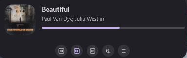
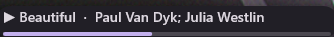
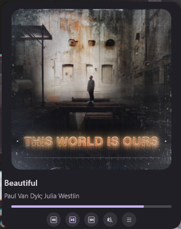
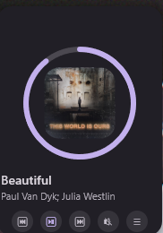
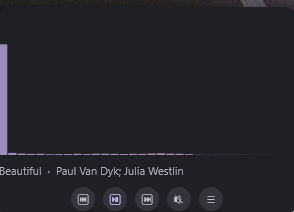
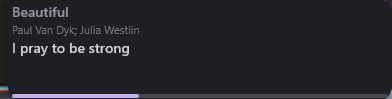

# floating clouds - foobar2000 plugus
**Language**: **ENGLISH** | [简体中文](README_CN.md)
***
Foobar2000 SDK Version: SDK-2025-03-07
Windows Template Library: WTL10_01_Release
***

A foobar2000 component that shows a floating now-playing overlay on the desktop or over fullscreen games. It displays album art, track title, artist, and playback controls.

## Components

This repository contains three independent foobar2000 components:

| Component | DLL | What it does |
| --- | --- | --- |
| **Floating Clouds** | `foo_floating_clouds.dll` | The floating now-playing overlay described below |
| **Playlist Organizer** | `foo_playlist_organizer.dll` | Groups an active playlist by album artist into locked, A-Z sorted per-artist playlists. [README](floating_clouds_organizing_playlists/README.md) |
| **Apple Music Tags** | `foo_floating_clouds_tags.dll` | Fetches Apple Music tags per region and writes them to selected tracks. [README](floating_clouds_tags/README.md) |

## Features

- Floating overlay: an independent topmost window above the desktop or fullscreen games
- 7 styles: Minimal, Full, Album Focus, Progress Ring, Visualizer, Lyrics Line, Visualizer + Cover
- 2 skins: Material 3 (MD3) and Apple liquid glass, each with dark and light palettes
- Color mode: follows foobar2000 by default, or you can force dark or light
- Font family: follows foobar2000's default UI font, or you can set a custom family in Preferences
- Per-pixel alpha rendering: UpdateLayeredWindow path (driver agnostic, avoids AMD DirectComposition flicker) with a uniform alpha fallback
- Smooth 60fps animation: frame rate independent easing for progress, fades, button state layers, and show/hide
- Customizable global hotkeys: drag mode, show/hide, cycle styles, cycle skins
- Click-through: buttons receive clicks, other areas pass through; drag mode moves the window
- System tray: right-click menu for styles, skins, and visibility
- Playlist picker: opens a three-level panel (playlists, albums, tracks)
- Lyrics: embedded LRC or plain text, synced to playback
- Real-time visualizer: smoothed FFT spectrum bars
- Preferences page: hotkeys, opacity, default style, skin, color mode, font family, auto-hide, UI language, debug logging

## Quick Start

1. Download the latest release from [Releases](https://github.com/Coconutat/floating-clouds---foobar2000-plugus/releases)
2. Install `foo_floating_clouds.fb2k-component`, or copy `foo_floating_clouds.dll` into your foobar2000 `components` directory
3. Restart foobar2000. The floating window appears automatically.
4. Default hotkeys: `Ctrl+Alt+D` toggles drag mode, `Ctrl+Alt+F` hide/show, `Ctrl+Alt+S` cycles styles, `Ctrl+Alt+T` cycles skins

> All hotkeys can be customized in `File > Preferences > Components > Floating Clouds`: click a
> hotkey box, then press the new key combination (must include Ctrl/Alt/Shift/Win).

## Screenshots

<table>
  <tr>
    <td align="center"><br/><b>Full</b></td>
    <td align="center"><br/><b>Minimal</b></td>
    <td align="center"><br/><b>Album Focus</b></td>
  </tr>
  <tr>
    <td align="center"><br/><b>Progress Ring</b></td>
    <td align="center"><br/><b>Visualizer</b></td>
    <td align="center"><br/><b>Lyrics Line</b></td>
  </tr>
</table>

## Styles

| Style | Description |
| --- | --- |
| Minimal | Single line: play icon, title and artist, thin bottom progress bar. Low obstruction, good for fullscreen games. |
| Full | Small album art, title/artist, progress bar, control buttons |
| Album Focus | Large album art as the hero visual, info and controls below |
| Progress Ring | Thumbnail surrounded by a circular progress ring |
| Visualizer | Real-time FFT spectrum bars plus track info, game HUD style |
| Lyrics Line | Current synced lyric line, visible at a glance during games |
| Visualizer + Cover | Album art and track info above the spectrum, with a wave-base progress line below. An option attaches the line to the wave baseline and matches its width to the bars. |

## Skins

| Skin | Description |
| --- | --- |
| MD3 | Material 3 surface card with rounded corners and an elevation shadow. Uses the baseline dark scheme by default and the light scheme when light mode is active. |
| Apple | Liquid glass style: a frosted translucent card with a gradient rim and a two-layer shadow. Uses system blue accents, and the visualizer wave and progress line share a blue-to-pink gradient. |

Both skins ship dark and light palettes. Color mode follows foobar2000 by default; you can force dark or light in Preferences. The font family follows foobar2000's default UI font, or you can type a custom family in Preferences.

## Requirements

- foobar2000 v2.0 or later (Windows 10 64-bit)

## Build

Requires Visual Studio 2019+ with C++17 support and the foobar2000 SDK.

The foobar2000 SDK is **not bundled** with this repository. Download the matching SDK version (2025-03-07) from <https://www.foobar2000.org/SDK> and extract it into an `SDK/` folder at the repository root. The project files reference `..\SDK\...` paths. Use it under its own license (`SDK/sdk-license.txt`).

The root `build.ps1` builds all three components in one run and collects the packages into the root `dist/` folder.

For AI or debugging workflows, use `build_agent.ps1`. It is non-interactive, builds sequentially, and prints MSBuild errors and warnings without the interactive menu or extra output redirection:

```
pwsh -NoProfile -File build_agent.ps1 -Component floating_clouds -Package
```

`build_agent.ps1` supports:

- `-Component all|floating_clouds|organizing_playlists|tags` (default `all`)
- `-Configuration Debug|Release`, `-Platform x64|Win32`
- `-VsInstallDir <path>`, `-Package`, `-Clean`, `-MinVersion <version>`

The original `build.ps1` remains available:

```
git clone <repo>
powershell -ExecutionPolicy Bypass -File build.ps1            # no args -> interactive menu (language / form / component)
powershell -ExecutionPolicy Bypass -File build.ps1 -Package   # build all 3 and package into root dist\
powershell -ExecutionPolicy Bypass -File build.ps1 -Language zh -Package   # Chinese prompts + package
```

Common parameters (combinable, scriptable / CI-friendly):

- `-Package` package `.fb2k-component` and collect into root `dist/`
- `-Deploy -Foobar2000Dir "<foobar2000 root>"` deploy the DLLs into foobar2000
- `-Component all|floating_clouds|organizing_playlists|tags` pick components (default all)
- `-Language en|zh` pick prompt language (default en)
- `-Configuration Debug`, `-Platform Win32`, `-Clean`, `-CleanOnly`, `-Force`
- `-Interactive` force the interactive menu

Running with no action switches starts an interactive menu (pick prompt language, then build form: DLL only / package / deploy / clean / all, then components). Each component's build output is written to `logs/<component>-<timestamp>.log`. Alternatively open `foo_floating_clouds/foo_floating_clouds.vcxproj` (etc.) in Visual Studio and build.

## License

See [LICENSE](LICENSE) for details.
